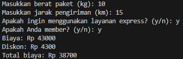

# ProgramPengiriman

- Nama : Roufan Awaluna Romadhon
- NIM : 31210423
- Kelas : TI.24.A.3

---

## Deskripsi
Program ini digunakan untuk menghitung biaya pengiriman berdasarkan berat paket, jarak pengiriman, dan pilihan layanan ekspres serta keanggotaan anggota yang memberikan diskon khusus.

---

## Program Untuk Menghitung Pengiriman

### Deskripsi Program:
Program ini menghitung biaya pengiriman berdasarkan beberapa parameter seperti berat paket, jarak pengiriman, layanan ekspres, dan status keanggotaan member. Biaya pengiriman dasar adalah Rp 10.000 dan dapat meningkat tergantung pada kondisi berikut:

- Tambahan Rp 5.000 jika berat lebih dari 5 kg.
- Tambahan Rp 8.000 jika jarak lebih dari 10 km.
- Tambahan Rp 20.000 jika menggunakan layanan express.
- Diskon 10% diberikan kepada pelanggan yang merupakan member.

### Kode Program
Kode program dapat dilihat dibawah ini atau buka file ini [`Pengiriman.py`](Pengiriman.py).
```python
def hitung_biaya_pengiriman(berat, jarak, express=False, member=False):
    # Biaya dasar
    biaya = 10000
    
    # Tambahan biaya jika berat lebih dari 5 kg
    if berat > 5:
        biaya += 5000
    
    # Tambahan biaya jika jarak lebih dari 10 km
    if jarak > 10:
        biaya += 8000
    
    # Tambahan biaya untuk layanan express
    if express:
        biaya += 20000
    
    # Simpan biaya sebelum diskon
    biaya_sebelum_diskon = biaya
    
    # Diskon untuk member
    diskon = 0
    if member:
        diskon = biaya * 0.1  # Diskon 10%
        biaya *= 0.9
    
    return int(biaya), int(diskon), int(biaya_sebelum_diskon)  # Mengembalikan nilai dalam bentuk integer

# Fungsi untuk meminta input dari pengguna
def main():
    berat = float(input("Masukkan berat paket (kg): "))
    jarak = float(input("Masukkan jarak pengiriman (km): "))
    express = input("Apakah ingin menggunakan layanan express? (y/n): ").strip().lower() == "y"
    member = input("Apakah Anda member? (y/n): ").strip().lower() == "y"
    
    biaya_total, diskon, biaya_sebelum_diskon = hitung_biaya_pengiriman(berat, jarak, express, member)
    
    print(f"Biaya: Rp {biaya_sebelum_diskon}")
    if member:
        print(f"Diskon: Rp {diskon}")
    print(f"Total biaya: Rp {biaya_total}")

# Menjalankan program
if __name__ == "__main__":
    main()
```

### Penjelasan Program:
Program ini terdiri dari dua bagian utama:

1. **Fungsi `hitung_biaya_pengiriman`**  
   Fungsi ini bertanggung jawab untuk menghitung total biaya pengiriman berdasarkan parameter berikut:
   - **Berat paket**: Jika lebih dari 5 kg, dikenakan biaya tambahan Rp 5.000.
   - **Jarak pengiriman**: Jika lebih dari 10 km, dikenakan biaya tambahan Rp 8.000.
   - **Layanan ekspres**: Jika dipilih, dikenakan biaya tambahan Rp 20.000.
   - **Status keanggotaan (member)**: Jika pelanggan adalah member, mereka mendapat diskon 10% dari total biaya sebelum diskon.
   
   Fungsi ini mengembalikan tiga nilai:
   1. **Total biaya setelah diskon** (dalam bentuk integer).
   2. **Jumlah diskon yang diberikan** (dalam bentuk integer).
   3. **Biaya sebelum diskon diterapkan** (dalam bentuk integer).

2. **Fungsi `main`**  
   Fungsi ini meminta input dari pengguna dan memanggil fungsi `hitung_biaya_pengiriman` untuk menghitung biaya pengiriman.
   - Pengguna memasukkan berat paket (kg).
   - Pengguna memasukkan jarak pengiriman (km).
   - Pengguna memilih apakah ingin menggunakan layanan ekspres.
   - Pengguna memilih apakah mereka adalah member.
   - Program menampilkan biaya sebelum diskon, jumlah diskon (jika ada), dan total biaya setelah diskon.

### Contoh Penggunaan:
Berikut adalah Contoh Penggunaannya:


